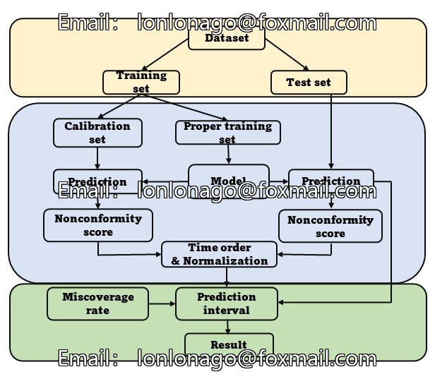
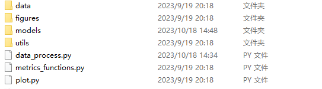
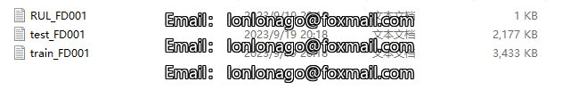

# Estimating the Remaining Lifespan of a C-MAPSS Wing Engine Using Data-Driven Approaches in Python

Algorithms include: CNN, DNN, LSTM, SVR, RF, GB.

Required modules are as follows:

```python
import keras
from keras.models import Sequential
from keras.layers import Dense, Dropout
from keras.optimizers import Adam
from sklearn.model_selection import train_test_split
from sklearn.metrics import mean_squared_error
import matplotlib.pyplot as plt
import pandas as pd
import numpy as np
import scipy
import scikit-learn
from tensorflow import keras
```

Note:
1. All the codes have been tested and there are no problems.
2. Please read the introduction carefully before you run the program because it involves different programming languages (Python or MATLAB).
3. The program is a special item, after sale will not return, if there are any problems please contact in time.
4. This code does not explain.
## Images






Here is a pay link on Stripe ( https://buy.stripe.com/3cs8yP7sY87d0vu9AB ). Please contact me lonlonago@foxmail.com after funding $89, and I will send you a complete data files , thank you!

